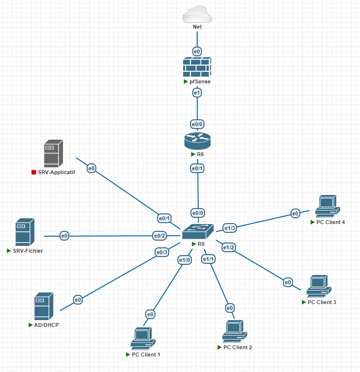

# Projet Infra :

## Sommaire :

### [Configuration réseau](./Conf)

- [Configuration router](./Conf/conf_router.md)
- [Configuration switch](./Conf/conf_switch.md)
- [Configuration DHCP](./Conf/conf_dhcp.md)

## R.A.C.I. :

| Tâches   | Réalisateur | Approbateur | Consulté | Informé |
| ------------------- | -------------- | -------------- | -------------- | -------------- |
| Analyze             | F  | F   | C   | C  |
| Planification  | F    | F            | C             | C             |
| Réalisation  | F    | F            | C             | C             |
| Validation recette      | F/C    | C            | F/C             | F/C             |

---

## Plan de projet :

### 1. **Initiation du Projet**
#### 1.1. Définition des objectifs
- **But du projet** : Fournir une infrastructure informatique minimale dans le cloud pour une PME.
- **Objectifs spécifiques** :
  - Mise en place d'un serveur AD/DHCP avec 4 comptes utilisateurs.
  - Création d'un serveur de fichiers avec une arborescence définie.
  - Déploiement d'un serveur applicatif accessible en HTTPS.
  - Installation et configuration de 4 postes clients Windows 10 ou 11.
  - Mise en place d'un firewall pour la gestion de la sécurité réseau.

### 2. **Planification**
#### 2.1. Identification des jalons et des tâches
- **Analyse des besoins**
  - Collecte des exigences techniques et fonctionnelles.
  - Analyse des contraintes et des ressources disponibles.

- **Conception de l'infrastructure**
  - Conception de l'architecture réseau.
  - Élaboration de l'arborescence des dossiers.
  - Planification de la sécurité réseau (firewall, VLAN).

- **Mise en place de l'infrastructure**
  - Jalon 1 :Création et configuration du serveur AD/DHCP.
  - Jalon 2 : Installation du serveur de fichiers et création des dossiers.
  - Jalon 3  : Déploiement du serveur applicatif et configuration de l'accès HTTPS.
  - Jalon 4 : Configuration des postes clients Windows.
  - Jalon 5 : Installation et configuration du firewall.
  - Jalon 6 : Mise en place d'outils de surveillance et configuration des alertes pour les incidents.

- **Tests et validation**
  - Tests de fonctionnalité pour chaque composant.
  - Validation de la sécurité et de la connectivité réseau.
  - Validation de l'accès utilisateur et des permissions.

- **Livraison et formation**
  - Livraison de l'infrastructure au client.
  - Formation des utilisateurs finaux et de l'administrateur IT de la PME.
  - Documentation complète de l'infrastructure et des procédures de maintenance.

### 3. **Exécution**
#### 3.1. Mise en œuvre des tâches
- **Installation et configuration** :
  - Utilisation d'une plateforme cloud (PNetLab) pour héberger les serveurs.
  - Déploiement des serveurs AD/DHCP, fichiers, applicatif.
  - Configuration des postes clients.
  - Mise en place et configuration du firewall avec les règles de sécurité définies.
  - Mise en place d'outils de surveillance et configuration des alertes pour les incidents.

### 4. **Clôture du Projet**
#### 4.1. Documentation et transfert
- **Documentation** :
  - Rédaction de la documentation technique détaillée.
  - Guide utilisateur pour les employés de la PME.

- **Formation** :
  - Session de formation pour l'administrateur IT et les utilisateurs finaux.

#### 4.2 Livraison et Validation
- **Vérification finale** :
  - Validation de tous les composants et services déployés.
  - Exécution des tests finaux avec la PME.
- **Livraison de l'infrastructure** :
  - Transfert officiel de l'infrastructure.
  - Signature de l'acceptation par la PME.

## Topilogie :

## Tableau des VLANs :

- Association VLAN <> réseau IP 

| VLAN              | VLAN 10 `client`    | VLAN 20 `serv`    | VLAN 30 `dhcp_ad` |
| ----------------- | ------------------- | ----------------- | ----------------- |
| Réseau IP associé | `10.33.10.0/23`     | `10.33.20.0/28`   | `10.30.30.0/27`   |

---

## Tableau d'adressage :

| Machine - Réseau  | `10.33.10.0/24` | `10.33.20.0/28` | `10.33.30.0/29` |
| ----------------- | --------------- | --------------- | --------------- |
| `ROUTEUR`         | `10.33.10.254`  | `10.33.20.14`   | `10.33.30.6`    |
| `AD/DHCP`         | ❌              | ❌             | `10.33.30.1`    |
| `SRV.Applicatif`  | ❌              | `10.33.20.1`    | ❌             |
| `SRV.Fichier`     | ❌              | `10.33.20.2`    | ❌             |
| `PC.CL1`          | `10.33.10.1`     | ❌             | ❌             |
| `PC.CL2`          | `10.33.10.2`     | ❌             | ❌             |
| `PC.CL3`          | `10.33.10.3`     | ❌             | ❌             |
| `PC.CL4`          | `10.33.10.4`     | ❌             | ❌             |

## Configuration ADDC

### Groupes

*🌐 Groupes de domaine globaux
🏠 Groupes de domaine Locaux
🖥️ Groupes système*

🖥️ Domain Admin  
🖥️ Domaine Server 

🌠GG-Direction 
- 🏠 GDL-Direction-R
- 🏠 GDL-Direction-W
    
🌠GG-Secretariat 
- 🏠 GDL-Secretariat-R
- 🏠 GDL-Secretariat-W
    
🌠GG-Commercial 
- 🏠 GDL-Commercial-R
- 🏠 GDL-Commercial-W
    
🌠GG-Jesaisplusquoi 
- 🏠 GDL-re-R
- 🏠 GDL-re-W

### Utilisateurs

*🖥️Utilisateurs système
🧑 Utilisateurs humain*

| Type  | Identifiant | Mot de passe | Groupe |
| ----------------- | --------------- | --------------- | --------------- |
| 🖥️ | admin | Boo1234 | Système |
| 🖥️ | srvfichier | Boo1234 | Système |
| 🧑 | elchef | Boo1234 | Direction |
| 🧑 | el??  | Boo1234 | ?? |
| 🧑 | elcom | Boo1234 | Commercial |
| 🧑 | elsec | Boo1234 | Secretariat |
